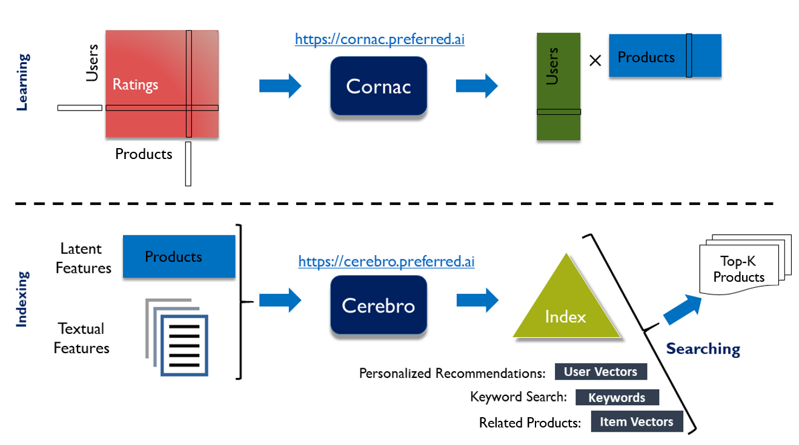
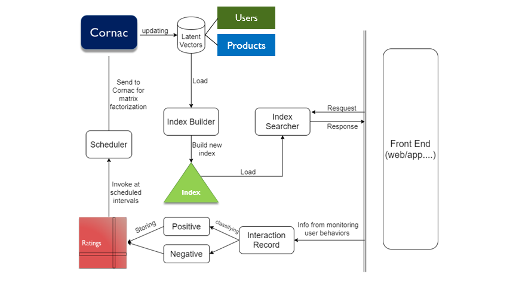

# Cerebro
Your preferred open source personalized recommendation retrieval engine.


[](https://maven-badges.herokuapp.com/maven-central/ai.preferred/cerebro)
[](https://travis-ci.org/PreferredAI/cerebro)
[](https://coveralls.io/github/PreferredAI/cerebro?branch=master)
[](https://www.javadoc.io/doc/ai.preferred/cerebro)

## Overview
Our goal is to create a closed-loop engine for recommendations with blazingly fast retrieval of objects.

#### Efficient Retrieval of Objects (Demo: [https://cerebro-demo.preferred.ai](https://cerebro-demo.preferred.ai/))
   - Personalized Recommendation
   - Keyword Search
   - Related Objects Search
   

<p align="center"><i>Cerebro supports various efficient similarity search</i></p>

#### Closed-loop Recommendation Engine
   - Tracking and recording users' feedbacks
   - Scheduling preference learning models for users' recommendations. 
   

<p align="center"><i>Cerebro supports closed-loop recommendation</i></p>
## Getting started

### Add a dependency
If you already have a project then just add Cerebro as a dependency to your pom.xml:
```xml
<dependency>
    <!-- Cerebro: Your personalized retrieval engine @ https://cerebro.preferred.ai/ -->
    <groupId>ai.preferred</groupId>
  	<artifactId>cerebro</artifactId>
  	<version>1.0</version>
</dependency>
```
 

